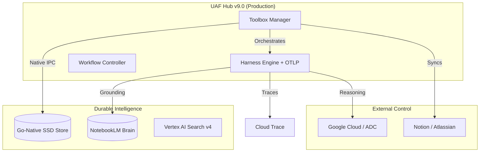

# 🚀 HEEYUN CHO: Unified Agentic Framework (UAF) v9.0 // Titan
**Standard**: Late-2026 MAS / MCP 4.0 | **Architect**: Senior MAS Engineer

The **Central Intelligence Hub** for the Gemini-UAF ecosystem. Project Titan represents the evolution of autonomous engineering into a **Hardened Agentic Operating System** that enforces deterministic orchestration through Finite State Machines (FSM) and high-fidelity visual grounding.

---

## 📡 Ecosystem Overview (v9.0)
Project Titan transforms individual MCP servers into a collaborative, zero-trust expert system.
- **Autonomous Scale**: Orchestrating 28+ specialized engineering agents.
- **Grounded Intelligence**: Multi-layered RAG across local SSD and Google Cloud Vertex AI.
- **Production Standard**: Certified with a 0.92 Readiness Score (Google Roadshow Standard).

## 🏗️ Titan Architecture (C4 Level 1)

## 🌟 Key Performance Milestones (v9.0)
- **Harness Engineering (FSM)**: Protocol-level Deterministic State Machine locking deployment tools until 100% security scan verification.
- **Go-Native Intelligence**: Core Memory Bank optimized for sub-millisecond indexing and asynchronous job handling.
- **Grounded RAG v2.5.0**: Advanced retrieval using **Dynamic Nonce Isolation** to prevent Directive Injection and Context Poisoning.
- **OTLP Observability**: Full OpenTelemetry integration providing an auditable "Flight Recorder" for every agent mission.
- **Cloud-Native Hub**: Transitioned to a REST API architecture ready for horizontal scaling on **Google Cloud Run**.

## 🛡️ Security-by-Design
- **Nonce-Based Isolation**: Turn-by-turn cryptographic signatures for all external context.
- **Enterprise Safety Shield**: Strict ADK 2026 enforcement of harassment and dangerous content blocks.
- **Directive Injection Gate**: Mandatory runtime filtering for administrative keyword protection.

## 📜 Evolution Roadmap
- [x] **v4.2.0 (Current)**: Project Titan - FSM, OTLP, and Cloud-Native API Hub.
- [x] **v2.5.0**: Grounded RAG with Nonce Isolation & NotebookLM sync.
- [x] **v1.0.0**: Go-native Memory Bank & ADK 2026 SQL Persistence.
- [ ] **v10.0.0**: Autonomous Self-Healing & Predictive Unit Test Loops (Future).

---
*Standardized by Gemini CLI | v9.0.0 "Titan" Deployment Active*
