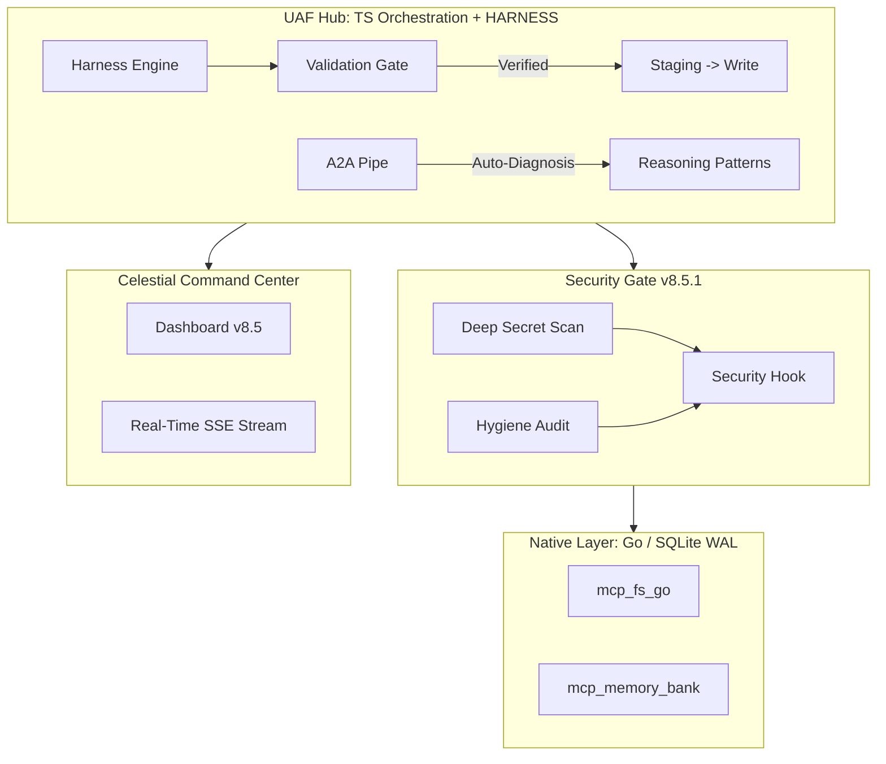

# 🚀 Unified Agentic Framework (UAF) v8.5 // Celestial

The **Central Intelligence Hub** for the Gemini CLI ecosystem. Evolved into a **Hardened Agentic Operating System** that enforces deterministic engineering through Harness guardrails and high-fidelity visual orchestration.

## 📡 Ecosystem Overview
This repository serves as the master command center for an autonomous suite of **23+ specialized engineering agents**.

## 🏗️ Celestial Architecture

## 🌟 Key Features (v8.5)
- **Harness Engineering**: Mandatory Mitchell Hashimoto loops (`Staging -> Validation -> Commitment`) for 100% deterministic writes.
- **Celestial Engine**: High-fidelity Dashboard v8.5 with Glassmorphism, Aurora gradients, and real-time SSE streaming.
- **Security Gate (v8.5.1)**: Integrated pre-commit validation hook with entropy-based secret detection.
- **Cognitive Hub**: Ultra-fast SQLite WAL persistence with multi-process concurrency safety.
- **Go-Native Performance**: Core I/O (FS, Memory) optimized for <5ms response times.

## 🛡️ Security Policy
Please refer to [SECURITY.md](SECURITY.md) for vulnerability reporting and security standards.

## 📜 Roadmap
- [x] **v4.1.0**: AI Memory Bank & Cognitive Loop integration.
- [x] **v7.0.0**: Streaming Engine & Direct Shell Bridge (Sub-50ms latency).
- [x] **v8.5.0**: Harness Engineering (Deterministic Cage) & Celestial UI.
- [x] **v8.5.1**: Security Gate Hook & Native README documentation.
- [ ] **v9.0.0**: Predictive Self-Healing & Autonomous Unit Test Loops.

---
**Standardized by Gemini CLI** | *v8.5.1 Deployment Active*
