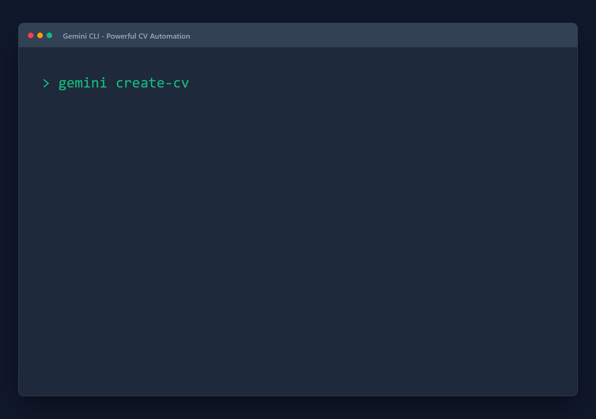

# Hi there, I'm Heeyun Cho 👋

  

## 🛠️ Senior Systems Engineer & Architect
Senior Systems Engineer and Architect with 15+ years of experience across **Automotive OTA**, **Embedded Linux (Yocto)**, and **Android Mobile Systems**. I specialize in bridging complex hardware-software interfaces for mission-critical platforms.

---

### 🚀 Autonomous Extensions (MCP)
*These tools are part of my active AI infrastructure research.*

*   **mcp_agent**: A self-extending AI orchestration server.
*   **mcp_search_local_file**: Sub-millisecond file system indexing and retrieval.
*   **mcp_prompt**: Intent-analysis middleware for engineering prompt optimization.
*   **record_gemini_cli**: Robust screen recording server optimized for mobile/web.
*   **programming-helper**: Expert guidance for language grammar and design patterns.

---

### 💼 Professional Impact

#### **Lead Validation Engineer @ Da vinci / Hyundai** (Aug 2025 — Present)
*   **CCU 2.0 (Hyundai):** Leading validation for Next-Gen Central Communication Units.
*   **Efficiency:** Automated 80% of routine triage using proprietary Python/Shell Log Analyzers.

#### **Android Auto Product Owner @ LG Electronics / VW** (Jul 2016 — Jun 2021)
*   **MIB3 / ICAS3 (Volkswagen):** Directed Google Android Auto development for VW's In-Car Application Server.
*   **Certification:** Led global certification across Audi, Porsche, and VW brands.

#### **Senior Android Developer @ LG Electronics / T-Mobile** (Feb 2011 — May 2016)
*   **Framework:** Built core Android applications for T-Mobile USA flagship lineup.
*   **DLNA Specialist:** Achieved S/W certification for media sharing across 20+ devices.

---

### 📺 System Impact & Orchestration Demo
*A verified demonstration of the Gemini CLI orchestrating complex tasks.*

  
   
  <a href="./System_Impact_Demo.mp4"><b>▶️ Watch the System Impact Demo</b></a>

---

### 🛠️ Technical Arsenal
*   **Automotive:** OTA Validation, ICAS3, CAN/LIN/Ethernet, Yocto Linux.
*   **Software:** TypeScript, Node.js, Python, Java (Android), C++ (Embedded).
*   **Protocols:** MCP, DLNA/UPnP, JSON-RPC.

---
*This profile is automatically managed by my custom Portfolio Manager MCP.*
